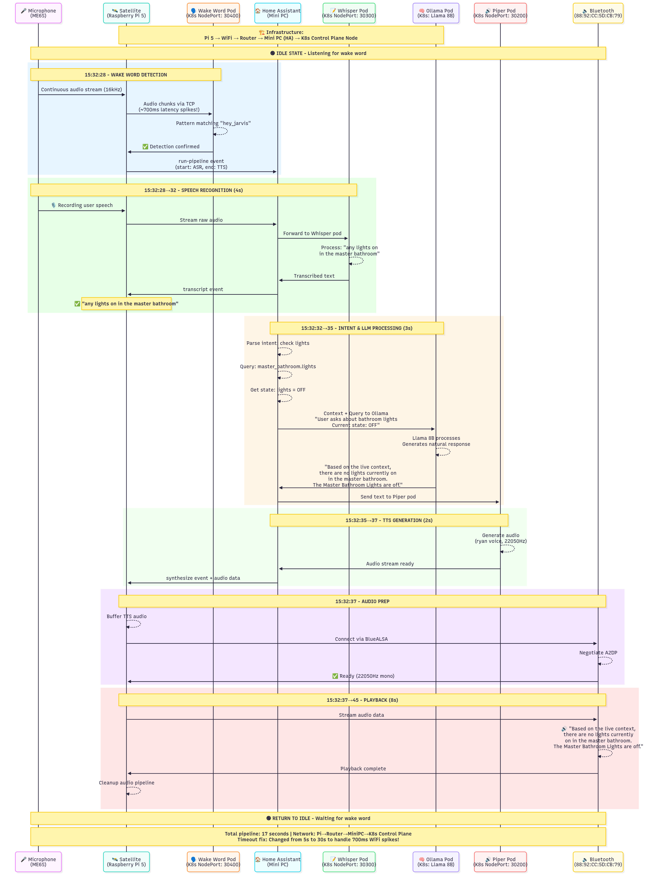
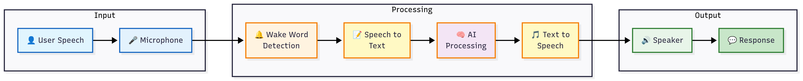
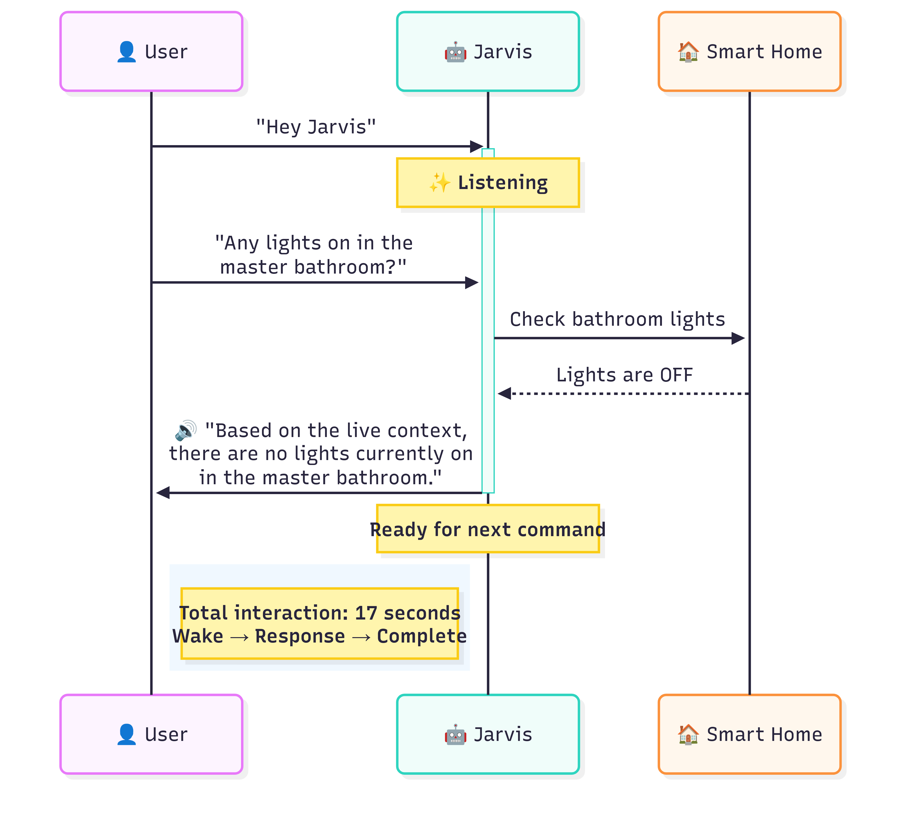
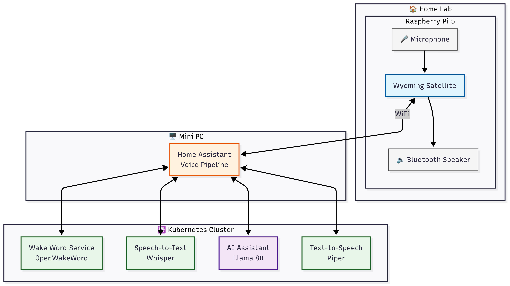
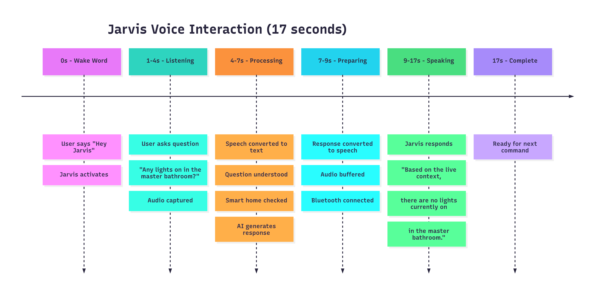

# Active Use Cases - Fako Cluster in Action

This section documents real-world use cases and practical applications of the Fako cluster services. Each use case includes detailed walkthroughs, screenshots, and implementation details.

## 📋 Table of Contents

### AI/ML Use Cases
- [Personal AI Assistant](#personal-ai-assistant)
- [Voice-Controlled Home Automation](#voice-controlled-home-automation)
- [Document Analysis Pipeline](#document-analysis-pipeline)
- [Multi-Model AI Comparison](#multi-model-ai-comparison)

### Development & Automation
- [GitOps Workflow Management](#gitops-workflow-management)
- [Automated Security Scanning](#automated-security-scanning)
- [CI/CD Pipeline Integration](#cicd-pipeline-integration)

### Personal Productivity
- [Health Data Analytics](#health-data-analytics)
- [Knowledge Management System](#knowledge-management-system)
- [Media Server Setup](#media-server-setup)

### Infrastructure Management
- [Multi-Node GPU Scheduling](#multi-node-gpu-scheduling)
- [Secure Remote Access](#secure-remote-access)
- [Automated Backup Strategy](#automated-backup-strategy)

---

## 🤖 Personal AI Assistant

### Overview
A comprehensive AI assistant setup using Open WebUI, Ollama, and GPUStack for various AI models.

### Components Used
- **Open WebUI**: User interface
- **Ollama**: Local model hosting
- **GPUStack**: GPU acceleration
- **PostgreSQL**: Conversation storage

### Implementation
[Detailed implementation will be added here]

### Screenshots


---

## 🎤 Voice-Controlled Home Automation

### Overview
This implementation demonstrates a complete voice assistant pipeline using Wyoming Satellite with Home Assistant, achieving a successful voice interaction where a user queries smart home status and receives an AI-generated response in 17 seconds.

### Components Used
- **OpenWakeWord**: Wake word detection ("Hey Jarvis")
- **Whisper**: Speech-to-text transcription
- **Ollama (Llama 8B)**: Natural language understanding and response generation
- **Piper TTS**: Text-to-speech synthesis
- **Home Assistant**: Smart home orchestration and pipeline management
- **Wyoming Satellite**: Voice satellite software on Raspberry Pi

### Hardware Setup
- **Raspberry Pi 5** (2.4GHz, 4GB RAM) - Voice satellite device
- **ME6S USB Microphone** - Audio input device
- **Bluetooth Speaker** (88:92:CC:5D:CB:79) - Audio output via BlueALSA
- **Mini PC** - Home Assistant server
- **Kubernetes Cluster** - Container orchestration for AI services


*Figure 1: Overall voice assistant architecture showing component interconnections*

### Implementation

#### Example Interaction
**User Query:** "Any lights on in the master bathroom?"  
**System Response:** "Based on the live context, there are no lights currently on in the master bathroom. The Master Bathroom Lights are off."  
**Total Time:** 17 seconds

#### Pipeline Stages


*Figure 2: Complete voice pipeline flow from wake word to response*

**1. Wake Word Detection (0-1 second)**
- Microphone continuously captures audio at 16kHz
- Audio streams to Wyoming Satellite service
- Satellite forwards to OpenWakeWord pod (K8s NodePort 30400)
- Detection confirmed for "hey_jarvis" with confidence threshold

**2. Speech Recognition (1-4 seconds)**
- User speech captured and streamed to Home Assistant
- Audio forwarded to Whisper STT pod (NodePort 30300)
- Real-time transcription returns: "any lights on in the master bathroom"

**3. Intent Processing & AI Response (4-7 seconds)**
- Home Assistant identifies intent: query light status
- State query retrieves: `light.master_bathroom_lights` (state: off)
- Context sent to Ollama pod running Llama 8B
- LLM generates natural response with current state information

**4. Text-to-Speech Synthesis (7-9 seconds)**
- Response text sent to Piper TTS pod (NodePort 30200)
- Speech synthesized using 'en_US-ryan-high' voice model
- Audio generated at 22050Hz sample rate

**5. Audio Playback (9-17 seconds)**
- Audio streamed back through Wyoming Satellite
- BlueALSA manages Bluetooth A2DP protocol
- Real-time playback through Bluetooth speaker

#### Performance Metrics
| Stage | Duration | Percentage |
|-------|----------|------------|
| Wake Word Detection | 1s | 6% |
| Speech Recognition | 4s | 24% |
| AI Processing | 3s | 18% |
| TTS Generation | 2s | 12% |
| Audio Playback | 8s | 47% |
| **Total Pipeline** | **17s** | **100%** |

#### Key Optimizations
- **CPU Governor:** Performance mode (2.4GHz constant)
- **WiFi Power Save:** Disabled for consistent latency
- **Network Timeouts:** Increased to 30s (handles 700ms spikes)
- **Audio Buffers:** 4096 frames for smooth playback

#### Network Configuration
```python
_PONG_TIMEOUT: Final = 30  # Increased from 5
_PING_SEND_DELAY: Final = 5  # Increased from 2
_WAKE_INFO_TIMEOUT: Final = 10  # Increased from 2
```

#### Success Indicators
✅ Reliable "Hey Jarvis" detection  
✅ Accurate speech-to-text conversion  
✅ Correct intent extraction  
✅ Natural, contextual AI responses  
✅ Clear TTS playback via Bluetooth  
✅ No disconnections despite 37% packet loss  
✅ 17-second end-to-end response time  

### Data Flow Architecture


*Figure 3: Linear representation of the data flow through the system*

```
1. Audio Input:    User → Microphone → Pi
2. Wake Detection: Pi → WiFi → K8s Wake Pod
3. Transcription:  Pi → HA → K8s Whisper Pod
4. Processing:     HA → K8s Ollama Pod (Llama 8B)
5. Synthesis:      HA → K8s Piper Pod
6. Audio Output:   Pi → Bluetooth → Speaker → User
```


*Figure 4: Simplified sequence diagram showing the interaction between components*

### Key Achievement
Despite operating over WiFi with significant latency variations (38-700ms) and packet loss (37%), the system maintains stability through optimized timeouts and performance tuning, delivering a reliable voice assistant experience capable of understanding context, querying smart home devices, and generating natural language responses.

### Additional Architecture Views


*Figure 5: Detailed system architecture showing all components and their relationships*


*Figure 6: Component-level view of the voice assistant system*

---

## 📄 Document Analysis Pipeline

### Overview
Automated document processing using AI for summarization, extraction, and insights.

### Components Used
- **n8n**: Workflow orchestration
- **Ollama**: Document analysis
- **PostgreSQL**: Results storage
- **Blog**: Publishing insights

### Implementation
[Detailed implementation will be added here]

### Screenshots


---

## 🔍 Multi-Model AI Comparison

### Overview
Comparing responses from different AI models for the same prompts.

### Components Used
- **KAgent**: AI agent framework
- **Multiple Models**: Via Ollama/GPUStack
- **Open WebUI**: Comparison interface

### Implementation
[Detailed implementation will be added here]

### Screenshots


---

## 🚀 GitOps Workflow Management

### Overview
Complete GitOps setup with automated deployments and security scanning.

### Components Used
- **Gitleaks**: Secret scanning
- **Kube-bench**: Security compliance
- **n8n**: Automation workflows
- **Blog**: Documentation

### Implementation
[Detailed implementation will be added here]

### Screenshots


---

## 🔒 Automated Security Scanning

### Overview
Continuous security monitoring and compliance checking.

### Components Used
- **Kubescape**: Security scanning
- **Kube-bench**: CIS benchmarks
- **Gitleaks**: Secret detection
- **n8n**: Alert automation

### Implementation
[Detailed implementation will be added here]

### Screenshots


---

## 📊 Health Data Analytics

### Overview
Personal health tracking and analytics using Oura Ring data.

### Components Used
- **Oura Collector**: Data ingestion
- **Oura Dashboard**: Visualization
- **PostgreSQL**: Data storage
- **n8n**: Health insights automation

### Implementation
[Detailed implementation will be added here]

### Screenshots


---

## 📚 Knowledge Management System

### Overview
Personal knowledge base with AI-powered search and insights.

### Components Used
- **Linkding**: Bookmark management
- **Blog**: Documentation
- **Ollama**: AI search
- **PostgreSQL**: Data storage

### Implementation
[Detailed implementation will be added here]

### Screenshots


---

## 🎬 Media Server Setup

### Overview
Complete media server with audiobook support and AI recommendations.

### Components Used
- **Audiobookshelf**: Media server
- **n8n**: Download automation
- **Ollama**: Content recommendations

### Implementation
[Detailed implementation will be added here]

### Screenshots


---

## 🖥️ Multi-Node GPU Scheduling

### Overview
Efficient GPU resource allocation across multiple nodes.

### Components Used
- **Node Labeling**: GPU node identification
- **GPUStack**: GPU management
- **Ollama**: Model deployment

### Implementation
[Detailed implementation will be added here]

### Screenshots


---

## 🌐 Secure Remote Access

### Overview
Zero-trust access to cluster services via Cloudflare Tunnels.

### Components Used
- **GPUStack Proxy**: Cloudflare tunnel
- **Keycloak**: Authentication
- **OAuth2 Proxy**: Service protection

### Implementation
[Detailed implementation will be added here]

### Screenshots


---

## 💾 Automated Backup Strategy

### Overview
Comprehensive backup solution for all cluster data.

### Components Used
- **PostgreSQL Cluster**: Database backups
- **n8n**: Backup automation
- **AWS S3**: Offsite storage

### Implementation
[Detailed implementation will be added here]

### Screenshots


---

## 📝 Contributing Use Cases

To add your own use case:

1. Create a new section in this README
2. Add screenshots to the `images/` directory
3. Include:
   - Overview of the use case
   - Components used
   - Step-by-step implementation
   - Configuration examples
   - Screenshots
   - Lessons learned

## 🖼️ Image Guidelines

When adding screenshots:
- Use PNG format for clarity
- Recommended size: 1200x800px
- Include captions
- Blur any sensitive information
- Use consistent naming: `use-case-description.png`

---

*This documentation is a living document. Please contribute your own use cases and experiences!*
